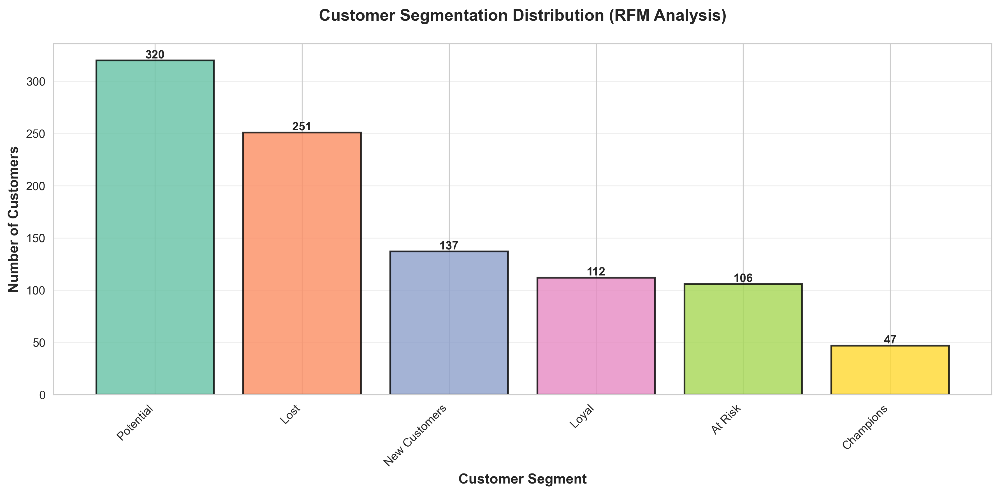
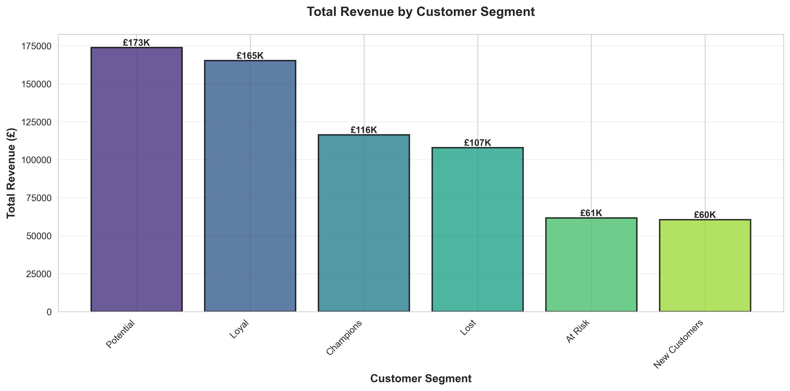
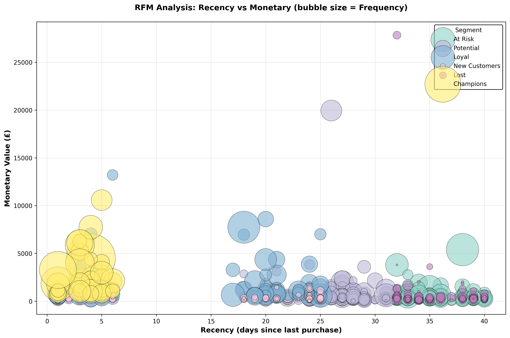

# Customer Segmentation & RFM Analysis for UK Retail

A data-driven framework to identify, understand, and target high-value customer segments, driving revenue and retention through personalised marketing strategies.

## 1. Business Impact

In the competitive UK retail market, generic marketing is inefficient and costly. This project addresses this by analysing **973 customers** and **£685,000 in revenue** to create a sophisticated segmentation model. The outcome is a clear framework for developing personalised campaigns that boost engagement, increase customer lifetime value (CLV), and maximise marketing ROI.

## 2. Key Features

*   **Advanced RFM Scoring:** Quantifies customer value by analysing Recency, Frequency, and Monetary data to identify top-tier and at-risk customers.
*   **Behavioural Clustering:** Uses K-Means clustering to move beyond manual thresholds and automatically discover natural, statistically significant customer segments based on purchasing behaviour.
*   **Actionable Segment Insights:** Translates complex data into clear, actionable personas (e.g., "Champions," "Loyal Customers," "At Risk"), each with tailored marketing strategies.

## 3. Technical Stack

*   **Core Analysis:** Python
*   **Data Manipulation & Modelling:** Pandas, Scikit-learn (for K-Means clustering)
*   **Data Visualisation:** Matplotlib, Seaborn
*   **Methodologies:** RFM Analysis, Customer Analytics, Predictive Modelling
*   **AI-Powered Insights:** Gemini AI (for generating strategic recommendations)

## 4. Use Cases

*   **Targeted Retention Strategies:** Proactively identify and re-engage "At Risk" customers with personalised "we miss you" campaigns before they churn.
*   **Personalised Campaign Targeting:** Design high-ROI campaigns tailored to specific segments, such as offering exclusive rewards to "Champions" or incentives to "Potential Loyalists."
*   **Customer Lifetime Value (CLV) Optimisation:** Focus marketing spend on acquiring and nurturing customer profiles that resemble high-value segments, improving the CLV:CAC ratio.

## 5. Installation & Usage

To replicate this analysis, follow these steps:

1.  **Clone the repository:**
    ```bash
    git clone https://github.com/natashaxavier/customer-segmentation.git
    cd customer-segmentation
    ```

2.  **Create and activate a virtual environment:**
    ```bash
    python -m venv venv
    source venv/bin/activate  # On Windows, use `venv\Scripts\activate`
    ```

3.  **Install the required dependencies:**
    ```bash
    pip install -r requirements.txt
    ```

4.  **Run the analysis script:**
    ```bash
    python scripts/calculate-rfm.py
    ```
    The script will process the raw data, perform the RFM analysis and clustering, and save the output and visualisations.

## 6. Results & Visualisations

The analysis successfully categorised the customer base into distinct, actionable segments. Visualisations provide a clear and immediate understanding of the business landscape.

### Segment Distribution
This chart reveals the size of each customer segment, highlighting that "Champions" and "Loyal Customers" constitute a significant, high-value portion of the base.



### Revenue by Segment
This bar chart clearly illustrates the commercial impact of each segment, confirming that "Champions" and "Loyal Customers" generate the vast majority of the company's revenue. This underscores the importance of investing in retention strategies for these groups.



### RFM Scatter Matrix
This matrix visualises the relationships between Recency, Frequency, and Monetary value across the segments, providing a deeper, multi-dimensional view of customer behaviour.



## 7. Live Demo

A comprehensive project showcase, including a detailed breakdown of the methodology, strategic recommendations, and business ROI, is available as a live web page.

➡️ **[View the Live Project Showcase](https://natashaxav.github.io/projects/customer-segmentation.html)**
